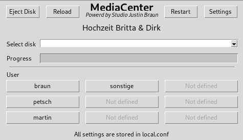

# MediaCenterPi

**MediaCenterPi** is a graphical utility for the **Raspberry Pi 4**, designed to help photographers and videographers transfer files quickly and effortlessly from an SD card or USB stick to an SSD — with minimal interaction.



---

## 🎯 Use Case

Perfect for **event photographers** or **videographers** who need a **fast, touch-friendly workflow** to back up media cards during or after a job — without needing to navigate through file managers.

---

## 💡 Features

- 🖥️ Modern **Tkinter-based GUI** (created with PAGE)
- ⚡ **Plug & copy**: insert a USB/SD card and start transfer with one tap
- 🔁 Automatically detects and mounts connected USB media
- 📂 Files are organized under the current event name and user
- 📦 Built-in progress bar and log output
- 🧑 Supports up to 9 user profiles (customizable)
- 🛠️ Simple configuration via `local.conf`
- 🖲️ Designed for **touchscreen use**, no keyboard/mouse required

---

## 🚀 Getting Started

### Requirements

- Raspberry Pi 4 (or similar Linux system)
- Python 3.x
- `tkinter`, `ttk`, `shutil`, `subprocess`, `configparser` (included with most distros)

### Installation

```bash
git clone https://github.com/studio-justin-braun/MediaCenterPi.git
cd MediaCenterPi
python3 mediacenter_merged.py
```

---

## ⚙️ Configuration

The configuration is stored in `local.conf` and contains:

- `[GENERAL]` – event title used as the folder name
- `[USERS]` – list of user buttons shown in the UI

A log file named `transfer.log` is created after each transfer.

---

## 📁 Folder Structure

```
MediaCenterPi/
├── mediacenter_merged.py
├── local.conf
├── transfer.log
├── screenshot.png
├── README.md
├── .gitignore
```

---

## 🙋‍♂️ Author

**Studio Justin Braun**  
[st-braun.de](https://st-braun.de)  
📧 service@st-braun.de

---

## 📜 License

MIT License
